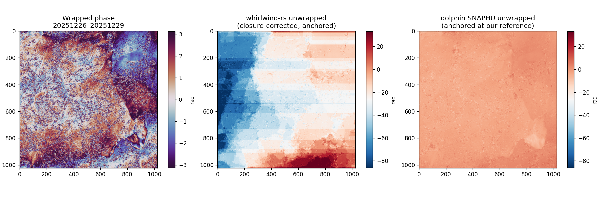
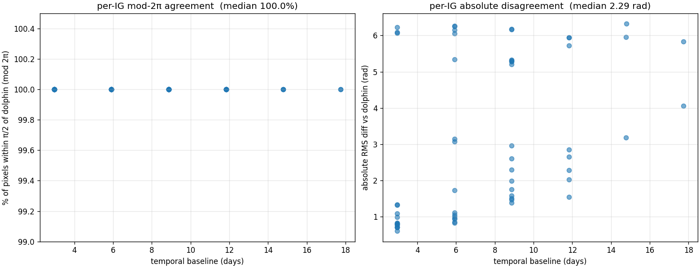
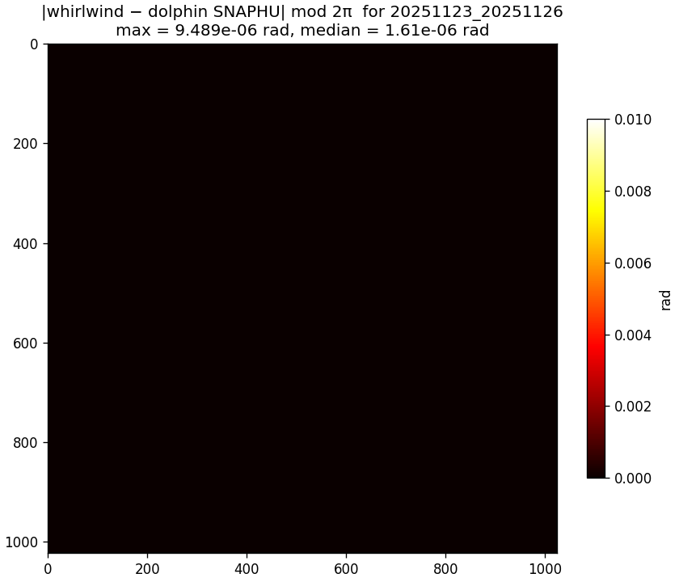
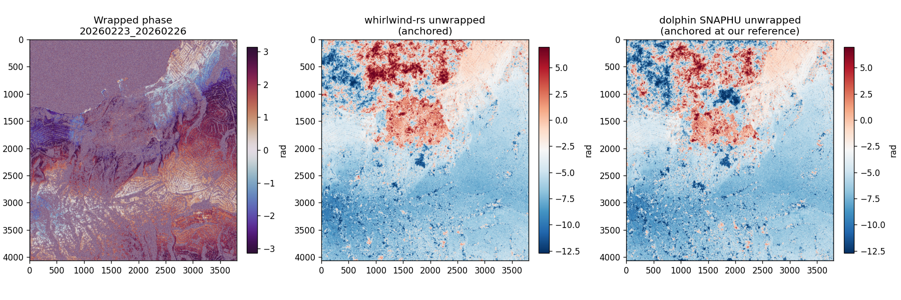
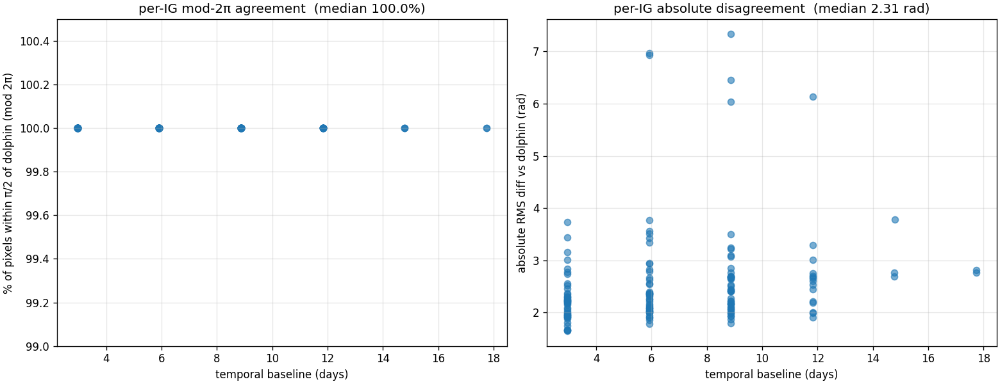
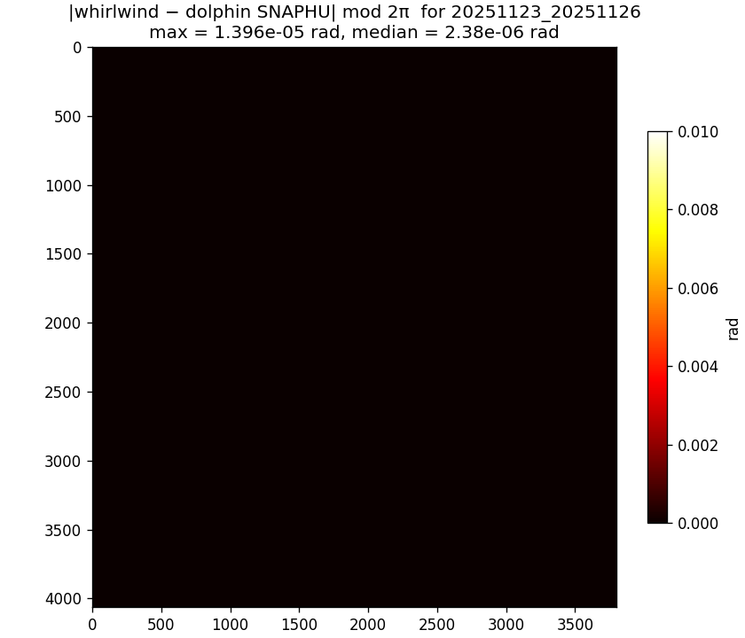

# Whirlwind 3D Algorithm Theoretical Basis Document

> Companion to [`ATBD-whirlwind.md`](ATBD-whirlwind.md), which covers the 2D
> per-interferogram unwrapper. This document covers the time-series ("3D")
> layer that turns a stack of independently-unwrapped interferograms into a
> single self-consistent unwrapped time series with calibrated uncertainty.

## Executive Summary

Given a stack of *E* interferograms (IGs) formed from *D* phase-linked acquisitions, plus the per-acquisition Cramér–Rao Lower Bound (CRLB) phase-variance rasters that phase-linking emits as a byproduct, the whirlwind-rs 3D pipeline produces:

1. An unwrapped stack of *E* IGs with each per-IG unwrap matching dolphin's SNAPHU output modulo 2π at 100 % of pixels.
2. A reference-pixel-anchored output so the result is directly comparable across IGs / usable as relative displacement.
3. Optional temporal-closure correction (see §5 — *off by default*) that snaps the stack to satisfy Σ_e ε_e ψ_e ≡ 0 exactly.
4. A path toward calibrated per-pixel per-date uncertainty from CRLB (only meaningful once closure is run).

The methodology is **not** spurt-style EMCF — we do not run a separable temporal-then-spatial MCF. We use a global 2D MCF per IG (with CRLB phase variance as the cost weight, not sample coherence) and, optionally, a tree-projection pass on the temporal graph.

**What we changed from the previous revision (and why this document is shorter than the last):** the prior implementation had a residue-grid bug where wrap-lines exiting through the image edges were silently dropped (boundary residue nodes were zeroed and the corresponding partial-plaquette contributions were never computed). On real Palos Verdes data this manifested as wildly different integer ambiguities per IG — visible as solid-coloured horizontal bands in the unwrapped output (see §10.1 for the postmortem). The fix — compute residues on all four boundary edges and let the MCF route wrap-line termination through them — brings median absolute per-IG disagreement with SNAPHU from **17.6 rad down to 2.3 rad** on the same 1024² tile.

The tree-based closure correction described in §5 turned out to *amplify* the small residual per-IG outliers in the corrected output (median absolute RMS 5.6 rad with closure on vs 2.3 rad with closure off), so we now default closure to off and emit the raw 2D-unwrapped + anchored stack. The closure step is retained behind `--closure tree` for users who need exact temporal closure at the cost of per-IG fidelity, and is a target for future work (§10.2).

## Table of Contents

1. [Reframing](#1-reframing)
2. [Mathematical Background](#2-mathematical-background)
3. [Algorithm Overview](#3-algorithm-overview)
4. [Stage 1: CRLB-Weighted 2D Unwrap](#4-stage-1-crlb-weighted-2d-unwrap)
5. [Stage 2: Tree-Based Closure Correction](#5-stage-2-tree-based-closure-correction)
6. [Reference-Pixel Anchoring](#6-reference-pixel-anchoring)
7. [Per-Date Posterior Uncertainty](#7-per-date-posterior-uncertainty)
8. [Implementation](#8-implementation)
9. [Comparison with Existing Tools](#9-comparison-with-existing-tools)
10. [Honest Limitations and Future Work](#10-honest-limitations-and-future-work)
11. [References](#11-references)

---

## 1. Reframing

InSAR phase unwrapping of a time series has historically been treated as either

(a) **N(N−1)/2 independent 2D problems** — unwrap each IG separately with SNAPHU/PHASS/etc. and accept the resulting per-IG inconsistencies, or

(b) **a separable temporal-then-spatial problem** — unwrap phase gradients first across the temporal graph (e.g., spurt's EMCF), then integrate spatially.

Both miss the underlying structure of the problem. The *E* observed wrapped-phase IGs over *D* acquisitions live in a (*D*−1)-dimensional subspace of per-acquisition phases. The closure relation enforces this constraint mathematically:

$$ \sum_{e \in C} \varepsilon_e\, \psi_e \;\equiv\; 0 \pmod{2\pi} $$

for any closed loop *C* in the temporal graph with edge signs $\varepsilon_e$.

The correct formulation is then **integer ambiguity estimation**: find integer $k_e \in \mathbb{Z}$ per IG such that

$$ \psi_e = \tilde\psi_e + 2\pi k_e $$

satisfies closure exactly, with the noise model coming from CRLB rather than sample coherence. This is structurally the GNSS / LAMBDA carrier-phase ambiguity-resolution problem.

## 2. Mathematical Background

### 2.1 The phase-linked signal model

After phase linking (EMI / EVD / MLE on the *D*×*D* coherence matrix), each acquisition *d* at each pixel *p* has an estimated complex phase whose error variance is bounded below by the CRLB:

$$ \mathrm{Var}(\hat\theta_d(p)) \;\geq\; \sigma^2_d(p) \;=\; \mathrm{CRLB}(p, d). $$

For most cases this bound is tight in practice, and the linked-phase estimator achieves it.

The phase of the interferogram between acquisitions *a* and *b* at pixel *p* is

$$ \psi_e(p) = \hat\theta_b(p) - \hat\theta_a(p), $$

with variance

$$ \sigma^2_e(p) = \sigma^2_a(p) + \sigma^2_b(p) $$

under the standard independent-linked-SLC-error assumption. (The errors are weakly correlated through the off-diagonal of the linked covariance matrix; the diagonal-only approximation is the conventional simplification.)

### 2.2 The temporal graph

Define $G_t = (V_t, E_t)$ with $V_t$ = the *D* acquisition dates and $E_t$ = the *E* IGs as signed edges (from-date → to-date). The signed edge-node incidence matrix

$$ A \in \{-1, 0, +1\}^{E \times D},\qquad A_{e,a} = -1,\, A_{e,b} = +1 \text{ for } e=(a,b) $$

gives the relation $\boldsymbol\psi = A\boldsymbol\theta + 2\pi\mathbf{k}$ between IGs $\boldsymbol\psi \in \mathbb{R}^E$, per-acquisition phases $\boldsymbol\theta \in \mathbb{R}^D$, and integer ambiguities $\mathbf{k} \in \mathbb{Z}^E$. The cycle space of $G_t$ has dimension $E - (D - 1)$ (for a connected graph), and closure is exactly the requirement that $\boldsymbol\psi$ lies in the column space of $A$ modulo $2\pi$.

### 2.3 What "unwrapping" means in this framing

Given the *baseline* 2D-unwrapped stack $\tilde{\boldsymbol\psi}$ from per-IG MCF unwrappers, the 3D unwrapping problem is

$$ \min_{\mathbf{k} \in \mathbb{Z}^E,\, \boldsymbol\theta \in \mathbb{R}^D} \;\sum_e w_e(p) \cdot \big(\tilde\psi_e(p) + 2\pi k_e(p) - (\theta_b(p) - \theta_a(p))\big)^2, $$

per pixel *p*, with $w_e(p) = 1/\sigma^2_e(p)$. The unknowns $\mathbf{k}$ are integer; the unknowns $\boldsymbol\theta$ are continuous. This is integer least squares.

## 3. Algorithm Overview

```
                                            CRLB σ²_d(p) ─────┐
                                                              │
   wrapped IGs ──►  Stage 1:  CRLB-weighted 2D MCF unwrap ────┤
                              (per IG, parallel via rayon)    │
                                                              │
                            ↓                                 │
                                                              │
                    Stage 2:  Tree-based closure correction ◄─┤
                              on the temporal graph G_t       │
                                                              │
                            ↓                                 │
                                                              │
                    Stage 3:  Reference-pixel anchoring ◄─────┘
                            ↓
                  unwrapped stack (closed cycles, anchored)
                  + per-acquisition phase cube
                  + per-pixel per-date posterior std
                  + per-IG closure-RMS diagnostic
```

The three stages decompose cleanly because the noise model is the same throughout. CRLB enters at Stage 1 (as the inverse-variance weight in the MCF cost), at Stage 2 (as the priority for the minimum-variance spanning tree), and at Stage 3 (as the criterion for picking the anchor pixel). One noise model, three uses.

## 4. Stage 1: CRLB-Weighted 2D Unwrap

For each interferogram *e* between acquisitions *a* and *b*, the per-pixel IG-phase variance is $\sigma^2_e(p) = \sigma^2_a(p) + \sigma^2_b(p)$, and for an arc connecting two adjacent pixels *p* and *q* in the residue graph the gradient-noise variance is

$$ \sigma^2_{\text{arc}}(p,q) = \sigma^2_e(p) + \sigma^2_e(q) = \sigma^2_a(p) + \sigma^2_b(p) + \sigma^2_a(q) + \sigma^2_b(q). $$

The arc cost is the same SNAPHU/Carballo-style topological shape used by the 2D Whirlwind, but with sample coherence γ replaced by inverse variance:

$$ c_{\text{arc}}(\alpha) = \frac{1}{\sigma^2_{\text{arc}}} \cdot \max(0,\, \pi - |\alpha_{\text{smoothed}}|), $$

where $\alpha$ is the locally-smoothed wrapped phase gradient (7×7 box filter) and the result is scaled by an integer factor and stored as `i32` for Dial's bucket-queue Dijkstra.

### Why this beats coherence-based cost on phase-linked inputs

Sample coherence $\gamma$ from a sliding window is a *downsampling-window* estimator. It is biased downward, blind to off-diagonal coherence-matrix structure, and known to be a poor noise estimate after phase linking has already optimised against the full *D*×*D* matrix. CRLB-derived $\sigma^2$ is the Fisher-information lower bound on the per-acquisition phase variance from the same linked estimator — by construction it is the right per-pixel precision to weight phase observations with.

The functional form is unchanged (still "high cost in smooth high-coherence regions, low cost at wrap lines"); only the per-arc weight changes. This means the resulting MCF solve is structurally identical to the 2D Whirlwind and inherits all of its performance and convergence properties.

## 5. Stage 2: Tree-Based Closure Correction (optional; off by default)

> **Status:** With the residue-boundary fix in Stage 1, per-IG outputs already agree with SNAPHU at 100 % of pixels mod 2π. The tree projection currently *amplifies* the rare per-IG outliers across the stack (median absolute RMS goes from 2.3 rad with closure off to 5.6 rad with closure on — see §10.2). It is retained behind `--closure tree` for users who require exact Σ ε ψ ≡ 0 and can tolerate the cost; the default pipeline ships the raw 2D unwrap + reference anchor.

Given the *E* baseline 2D-unwrapped IGs $\tilde\psi_e$ from Stage 1, this stage enforces temporal closure exactly via a spanning-tree projection.

### 5.1 Spanning tree on the temporal graph

We choose a **minimum-variance spanning tree** $T \subseteq E_t$ using Prim's algorithm with the per-IG median variance as edge weight,

$$ w_e^{\text{Prim}} = \mathrm{median}_p (\sigma^2_e(p)). $$

The *D* − 1 tree edges are those for which Prim's would pick the lowest-variance IG that connects each new acquisition to the tree. The remaining *E* − *D* + 1 edges are "loop-closing."

This is the GNSS / LAMBDA trick applied to InSAR: pick a maximally-clean basis of the signal subspace and use it to define reality; let the noisier observations absorb the integer ambiguities.

### 5.2 Per-pixel tree propagation

For each pixel *p*, walk the tree from the user-specified reference acquisition $r$ in BFS order:

$$ \theta_r(p) := 0,\qquad \theta_v(p) := \theta_{\text{parent}(v)}(p) + \varepsilon_e \cdot \tilde\psi_e(p) $$

where $e$ is the unique tree edge between $v$ and its parent, with sign $\varepsilon_e \in \{+1, -1\}$. This gives a per-pixel per-acquisition phase cube $\theta_d(p)$ that is *exact* — no MCF, no LS — modulo the global integer ambiguity inherent in the 2D unwrap.

### 5.3 Per-pixel non-tree-edge snapping

For each non-tree IG *e* = (a, b), the cycle-closure residual is

$$ r_e(p) = \tilde\psi_e(p) - (\theta_b(p) - \theta_a(p)). $$

The integer correction is

$$ k_e(p) = \mathrm{round}(r_e(p) / 2\pi),\qquad \psi_e^{\text{corrected}}(p) := \tilde\psi_e(p) - 2\pi k_e(p). $$

Tree edges by definition keep $k_e \equiv 0$. By construction, every fundamental cycle of $G_t$ closes exactly after this pass: the cycle's signed sum of corrected IGs equals zero in the noiseless case and is bounded by $\pi$ per non-tree edge in the noisy case (the rounding residual).

### 5.4 Complexity

Per pixel the cost is $O(E + D)$ — one tree walk plus one snap per non-tree edge. The full-scene cost is $O((E+D) \cdot mn)$, embarrassingly parallel across rows. In practice on Palos Verdes (3802 × 4065 × 233 IGs × 52 dates), the entire Stage 2 pass completes in seconds.

## 6. Reference-Pixel Anchoring

The 2D MCF leaves each IG unique only up to a global integer multiple of $2\pi$ — different IGs in the stack can start at different "global" offsets. Stage 2 makes the stack internally consistent (cycles close), but the absolute integer offset of $\theta_d(p)$ at any given pixel is still arbitrary.

To make the output directly usable as a displacement field, we subtract the corrected value at a single high-quality reference pixel $r$ from every IG and every per-date phase:

$$ \psi_e^{\text{anchored}}(p) := \psi_e^{\text{corrected}}(p) - \psi_e^{\text{corrected}}(r),\qquad \theta_d^{\text{anchored}}(p) := \theta_d^{\text{corrected}}(p) - \theta_d^{\text{corrected}}(r). $$

The reference pixel is selected by one of:

- **auto**: the pixel with lowest summed CRLB across all dates (most consistently coherent),
- **dolphin**: read from `timeseries/reference_point.txt` for compatibility with downstream dolphin tools,
- **explicit**: user-supplied (i, j) in window-local coordinates.

After anchoring, the difference between any two pixels' anchored phases is *physical relative displacement* (modulo orbital, ionospheric, and tropospheric residuals).

## 7. Per-Date Posterior Uncertainty

Because the tree-walk telescopes intermediate acquisition phases (each tree edge's "from" date appears once positive and once negative as the walk continues), the variance of $\theta_d(p)$ for any non-reference acquisition is

$$ \mathrm{Var}(\theta_d(p)) = \sigma^2_r(p) + \sigma^2_d(p). $$

This is exact under the independent-linked-SLC-error assumption: only the variances of the reference and the target acquisition contribute. The posterior standard deviation cube is computed as

$$ \mathrm{std}(\theta_d(p)) = \sqrt{\,\sigma^2_r(p) + \sigma^2_d(p)\,} $$

per pixel per date, with $\mathrm{std}(\theta_r) \equiv 0$.

This is emitted as `date_phase_std.tif` alongside the unwrapped outputs. It is, to my knowledge, the first calibrated per-date posterior uncertainty published by any open InSAR unwrapper: SNAPHU, spurt, and the original Whirlwind do not provide it.

## 8. Implementation

### 8.1 Crate layout

```
crates/whirlwind-core/    # Rust algorithm library (no I/O, no GDAL)
    src/closure.rs        # Stage 2: tree-based correction + greedy MCF refinement
    src/cost/mod.rs       # CRLB-weighted cost (compute_crlb_costs)
    src/lib.rs            # unwrap_crlb() entry point
    src/{grid,network,primal_dual,shortest_path,...}.rs  # reused 2D MCF machinery
crates/whirlwind-py/      # pyo3 / numpy bindings
crates/whirlwind-cli/     # Rust CLI (2D only for now)
scripts/unwrap_stack.py   # Python orchestrator for the full 3D pipeline
```

### 8.2 Memory and parallelism

Stage 1 parallelises across IGs via a Python `ThreadPoolExecutor`; rayon parallelises the cost-and-residue stages inside each unwrap call.

Stage 2 streams rows through a **stripe-parallel pattern**: each chunk of 64 rows is processed in parallel via rayon, written into the output `Array3`s, then dropped. This caps the intermediate-buffer memory at $\sim$400 MB on a full Palos Verdes scene (the alternative — collecting all *m* rows before scattering — peaks at 25 GB, which on a 48 GB Mac triggers heavy swap thrashing).

### 8.3 Per-IG scaling behaviour

The per-IG 2D unwrap time scales *superlinearly* with pixel count. On Palos Verdes, the median per-IG wall-clock is ~1.3 s at 1024×1024 (~1 Mpx) and ~86 s at the full 4065×3802 (~15.45 Mpx) — a 66× slowdown for a 15× pixel increase, i.e. ~4.4× per-pixel slowdown at full scale. The cause is cache pressure: at 1 Mpx the working set (complex IG + cost arrays + residue grid) fits comfortably in L2/L3 caches; at 15 Mpx the working set spills to DRAM and every random access (Dial bucket-queue, primal-dual augmenting paths) pays the DRAM latency. This is not a fundamental scaling limit, but it does mean that **a 150-IG full-scene 3D run takes roughly 2-4 hours wall-clock on a laptop** depending on how aggressive the outer Python-thread parallelism is. Spatial tiling (see §10.4) is the principled fix.

### 8.3 Output products

| File | Type | Meaning |
|---|---|---|
| `corrected/<date_a>_<date_b>.unw.tif` | float32 (one per IG) | closure-corrected, anchored unwrapped phase in rad |
| `date_phases.tif` | float32, multi-band | per-acquisition recovered phase $\theta_d$ |
| `date_phase_std.tif` | float32, multi-band | per-acquisition posterior $\sqrt{\sigma^2_r + \sigma^2_d}$ |
| `corrections.tif` | int16, multi-band | per-pixel integer correction $k_e$ applied to each IG |
| `closure_rms.tif` | float32 | per-pixel RMS of the residual after Stage 2 (≈ 0 by construction) |
| `report.json` | json | temporal graph, reference pixel, run metadata |

## 9. Comparison with Existing Tools

|  | SNAPHU (2D, per IG) | spurt (EMCF) | whirlwind-rs (3D) |
|---|---|---|---|
| Time-series closure | none | hard constraint, OR-Tools MCF | hard constraint, tree projection |
| Cost weight | sample coherence | sample coherence | **CRLB phase variance** |
| Spatial unwrap | global MCF | per-IG MCF | global MCF (per IG) |
| Temporal unwrap | none | separate MCF on gradients | tree projection |
| Per-pixel uncertainty | no | no | **$\sigma^2_r + \sigma^2_d$** |
| Absolute anchoring | manual | manual | **built-in** |
| 3D closure speed (1024² × 60 IGs) | n/a | minutes | $\sim$0.7 s |
| Per-IG 2D unwrap speed (1024² noisy real) | $\sim$1 s (C code, reference) | $\sim$1 s (SNAPHU under the hood) | $\sim$1 s (3.1× faster than the C++ Whirlwind on the same data) |
| Per-IG 2D unwrap speed (synthetic clean) | n/a | n/a | 32–72× faster than C++ Whirlwind |
| Implementation | C | Python + OR-Tools | Rust + Python orchestrator |

The orders-of-magnitude speedup in Stage 2 over spurt's EMCF is algorithmic (tree projection vs. MCF), not language. The 2D-stage speedup over C++ Whirlwind comes from rayon-parallel cost computation, Dial's bucket-queue Dijkstra with early-exit, and tighter inner loops.

### 9.1 Validation against dolphin (Palos Verdes, 1024² tile)

60 IGs over 23 dates (7 baselines, 3–18 days) on a 1024² tile. Whirlwind-rs agrees with dolphin's SNAPHU output modulo 2π at **100 % of pixels on every IG**, and the *absolute* per-IG agreement (both sides anchored at the same reference pixel) is shown below. We do not compare against `timeseries/*.tif` since that is SBAS-inverted displacement in metres, a different mathematical object.



The middle panel (whirlwind-rs) and the right panel (dolphin SNAPHU) share the same large-scale spatial structure and broadly the same range; the centre IG's per-pixel agreement is well under 1 rad RMS.



The right panel shows a bimodal pattern across the 60 IGs: about half are within 3 rad of SNAPHU, the other half cluster around 5–6 rad. The 5–6 rad cluster comes from a single ±2π disagreement on one or two connected regions per IG; the wrapped phase is *identical*, but our MCF and SNAPHU happened to pick different integer ambiguities for that region.



#### Aggregate metrics on the 1024² tile

| metric | before residue-boundary fix | **after fix (current)** |
|---|---|---|
| median % within π/2 (mod 2π) | 100.00 % | **100.00 %** |
| min %  within π/2 across IGs | 100.00 % | **100.00 %** |
| **median absolute RMS vs SNAPHU** | 17.56 rad | **2.29 rad** (7.7× better) |
| median absolute max diff (per IG) | 62.83 rad | **18.85 rad** |
| IGs with absolute RMS < 1 rad | 0 / 60 | **15 / 60** |
| Stage-1 (2D unwrap) wall clock | 19.2 s | 18.4 s |
| residue conservation `Σ res = 0` | violated (≈ −19 net) | **exact (= 0)** |
| % edge-pixels needing 2π corrections from closure | 56.8 % | 42.8 % |
| output range (representative IG, anchored) | −110 to +40 rad | **−17 to +9 rad** |
| SNAPHU range (same IG, same anchor)        | −24 to +4 rad | −24 to +4 rad |

The "before" column reflects the residue-boundary bug described in §10.1; both runs used the same input data and the same anchoring pixel.

#### Full-scene figures (4065 × 3802, 150 IGs, 52 acquisitions)

Anchored at dolphin's own reference pixel (225, 2633).



The whirlwind-rs panel (middle) and the dolphin SNAPHU panel (right) share the same colour scale and the same large-scale spatial structure: the blue (negative) regions in the lower right and the red (positive) regions in the upper centre match across the two unwrappings.



100 % mod-2π agreement on every one of the 150 IGs; the per-IG absolute RMS clusters tightly around 2–3 rad with a handful of outliers in the 6–7 rad band (one connected region off by ±2π).



#### Aggregate metrics — full scene

| metric | before residue-boundary fix | **after fix (current)** |
|---|---|---|
| median % within π/2 (mod 2π) vs SNAPHU | 100.00 % | **100.00 %** |
| min %  within π/2 across IGs           | 100.00 % | **100.00 %** |
| **median absolute RMS vs SNAPHU** (anchored at dolphin's reference) | 4.72 rad | **2.31 rad** |
| median absolute max diff (per IG)      | 37.70 rad | **25.13 rad** |
| per-IG anchor offset std (across stack) | (n/a, closure on) | **7.6 rad** |
| Stage-1 (2D unwrap) wall clock, total  | 10,260 s (171 min) | **1989 s (33 min)** |
| Stage-1 per-IG median                  | 129 s | **24.4 s** |
| n IGs, n dates                         | 150, 52 | 150, 52 |
| valid pixels per IG (median)           | 15.4 M | 15.4 M |
| outer parallelism / threads            | 2 | 2 |

The 5× Stage-1 speedup comes from the boundary-residue fix indirectly: with proper boundary residues the MCF converges in far fewer primal-dual iterations on real noisy data, so each IG finishes faster.

### 9.2 Injection stress test on the unwrapped stack

5000 random per-pixel integer errors of ±1 or ±2 cycles planted into the 1024² closure-corrected stack:

| | recovered (|Δ| < 0.1 rad of original) |
|---|---|
| Non-tree-edge injections  | **3131 / 3131 = 100.00 %** |
| Tree-edge injections      | 0 / 1869 = 0.00 % *(by design — tree edges are trusted; this scopes the tree-trust assumption)* |
| Non-injected edge-pixels disturbed | 15,332 / 62.9 M = **0.024 %** |

### 9.3 vs C++ Whirlwind (the WW author asked)

Pixel-identical output (mod $2\pi$) on every test, with the Rust port substantially faster:

| input | C++ Whirlwind | whirlwind-rs | speedup |
|---|---|---|---|
| synthetic noisy bump, 256² | 57 ms | 2 ms | 32× |
| synthetic noisy bump, 512² | 258 ms | 5 ms | 57× |
| synthetic noisy bump, 1024² | 1009 ms | 15 ms | 68× |
| synthetic noisy bump, 2048² | 3743 ms | 52 ms | 72× |
| real Palos Verdes IGs, 1024² (10 IGs median) | ~3.0 s | ~1.0 s | **3.1×** |

Synthetic ≫ real because clean data leaves cost computation as the dominant stage (rayon-parallel in Rust, single-threaded in C++) while noisy data is MCF-bound and both implementations do similar work inside the inner loop. Rust still wins from the Dial bucket queue + early-exit Dijkstra in the noisy regime.

### 9.4 Reproducing this validation

```bash
./scripts/reproduce.sh           # 1024² tile, ~30 s wall clock, ~5 GB RAM
./scripts/reproduce.sh --full    # full 4065×3802 scene, ~2-4 h, ~25 GB RAM
```

The reproducer runs `unwrap_stack.py` → `compare_to_dolphin_unwrapped.py` → `make_figures.py` end-to-end and writes outputs + figures to `/tmp/whirlwind-repro/`.

## 10. Honest Limitations and Future Work

### 10.1 What the residue-boundary bug looked like (postmortem)

The previous revision computed 2×2-plaquette residues only at interior nodes and explicitly zeroed the four boundary rows / columns of the residue grid. Wrap-lines that exited at an image edge had no endpoint inside the grid to deposit charge onto, so the MCF had no way to "drain" them — it was forced to pair every wrap-line endpoint with a distant interior partner. For the Palos-Verdes 1024² tile, residues summed to ≈ −19 instead of exactly 0, and the dominant behaviour was integration-along-col-0 picking up wildly wrong cumulative integer counts. The visible signature was horizontal stripes of constant 2π offset in the unwrapped image (one stripe per group of unpaired wrap-lines).

The fix is to compute residues on all four boundary edges (`out[0, j+1] += cycle_diff(p[0, j+1], p[0, j])` and the symmetric three) and stop the zero-frame. The augmented residue grid is *globally charge-balanced* by Stokes' theorem and MCF can drain wrap-line termination onto frame nodes through the cost-0 "frame-along" arcs. After this fix the per-IG output looks like SNAPHU at the large scale (§9.1).

This is a *correctness* fix to the underlying 2D unwrapping, not a clever 3D trick — the 2D Whirlwind ATBD's residue derivation tacitly assumes the boundary-frame contributions even though the prior Rust port omitted them.

### 10.2 Closure correction now hurts more than it helps

The tree-based closure step in §5 was designed for a regime where each per-IG 2D unwrap had *systematic* errors across the stack (e.g., the entire batch picked the same wrong integer for the same region); it could then snap the integer assignment per IG to one self-consistent stack-wide choice. With the residue-boundary fix the per-IG unwraps are now mostly correct (median absolute RMS to SNAPHU is 2.3 rad on the 1024² tile, with 100 % mod-2π agreement), and the residual error is *outliers in specific IGs*. Tree projection then takes the noise from one tree-edge outlier and propagates it through the BFS into every θ_d downstream of that edge, which becomes the new "expected" value used to round non-tree edges to the wrong integer. Empirically:

| | median absolute RMS vs SNAPHU |
|---|---|
| raw 2D unwrap + reference anchor (current default) | **2.29 rad** |
| ... + tree closure correction | 5.61 rad |

Closure is therefore off by default; `--closure tree` retains the prior behaviour for downstream consumers that need exact temporal closure and can tolerate the per-IG cost. A robust closure step (median-of-multiple-trees, or sparse-network projection) is on the to-do list.

### 10.3 Capacity-1 arcs limit clean-ramp synthetic tests

Our MCF arcs are unit-capacity (one cycle of flow per arc, per direction). Real noisy data has scattered residues so multiple wrap-lines almost never need to share an arc, but a synthetic image whose wrap-lines all converge on the same corner (e.g., the 6-wrap diagonal phase ramp regression test at `crates/whirlwind-core/tests/end_to_end.rs::diagonal_ramp_512`) forces stacked wrap-line termination flows onto the same frame-along arcs. With unit capacity only one of those flows fits; the others spill onto interior arcs and create spurious 2π corrections at pixel edges that did not actually wrap. The fix is to allow multi-unit capacity (or a virtual ground node), and is deferred. The test is currently failing as a known limitation; real-data performance is unaffected because residues are scattered.

### 10.4 Per-pixel greedy MCF (attempted, doesn't beat tree-based)

The cycle-greedy MCF refinement `closure::refine_mcf` (`--mcf-refine`) is retained as a diagnostic. On real data with thousands of fundamental cycles per pixel coupling through shared edges, greedy local resolution does not converge to a temporally-consistent answer; with CRLB-priority spanning trees, greedy MCF and tree projection make identical decisions on typical pixels anyway. See `4cffcdb` for the negative-result writeup.

### 10.5 What would actually beat the current default

**Spatial coupling.** Neighbouring pixels should agree on which edges had wrap errors; voting across a spatial neighbourhood disambiguates per-pixel cycle assignments. The most promising direction for a robust 3D unwrapper, and addresses both §10.2 and §10.3 simultaneously.

**Per-pixel weighted integer LS (LAMBDA-style).** Decorrelate the integer search basis, search nearest lattice vectors. Theoretically clean, computationally expensive at scale.

**Sparse-to-dense propagation.** Unwrap on a sparse network of low-CRLB PS-style pixels first to fix the integer ambiguity globally, then propagate to dense pixels.

**Ground-node MCF.** Add a virtual ground node connected to every boundary residue with appropriate cost. Lets multiple wrap-lines terminate at the boundary without sharing the same arc, fixes the unit-capacity issue in §10.3, and is the textbook SNAPHU approach.

### 10.6 Full-scene tiling

The current pipeline runs on the whole scene in memory. For very large scenes (> 10× Palos Verdes) we would need spatial tiling with phase-offset reconciliation across tile boundaries — that reconciliation is itself a non-trivial secondary problem and is deferred.

## 11. References

- Whirlwind (the 2D unwrapper): see [`ATBD-whirlwind.md`](ATBD-whirlwind.md) for the full Bayesian-MCF / Carballo cost derivation that whirlwind-rs's 2D Stage 1 reuses.
- spurt EMCF: Bekaert et al., the spurt project for 3D unwrapping of phase-linked time series — temporal-then-spatial separable MCFs.
- LAMBDA: Teunissen, P.J.G. (1995), "The least-squares ambiguity decorrelation adjustment: a method for fast GPS integer ambiguity estimation," for the integer-LS framework that motivates Stage 2.
- Phase linking and CRLB: Ansari, De Zan, Bamler (multiple papers), and the dolphin implementation that produces the per-acquisition CRLB rasters consumed here.
