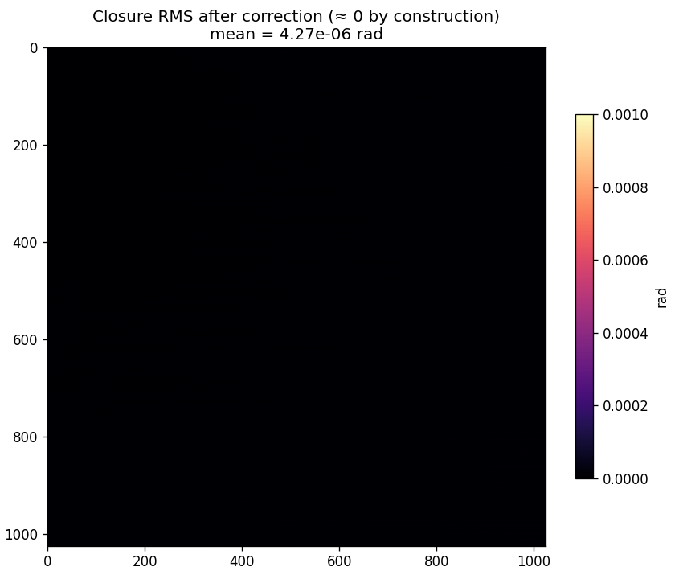
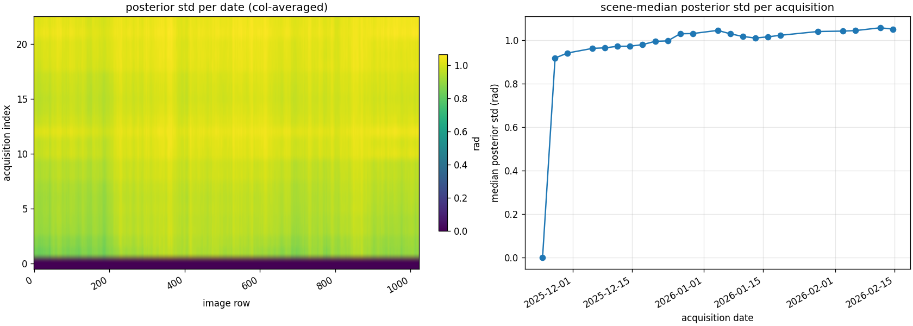
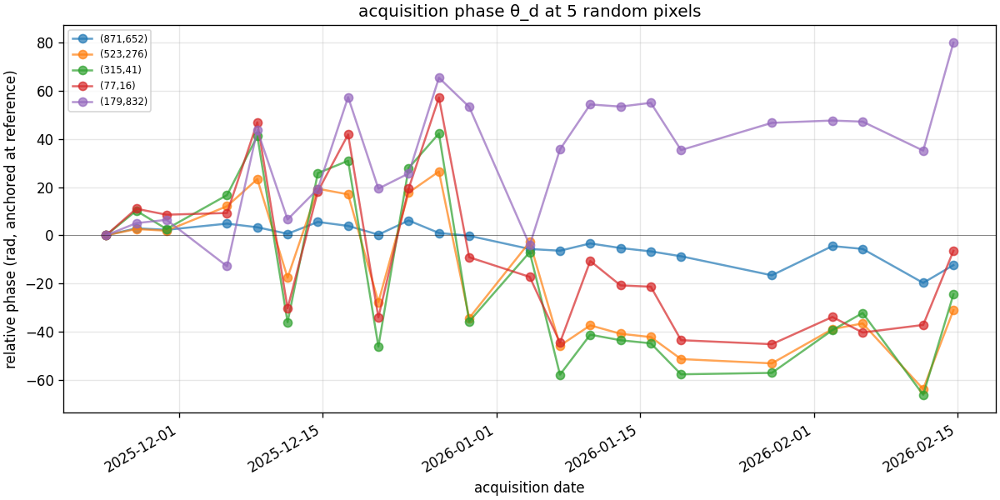
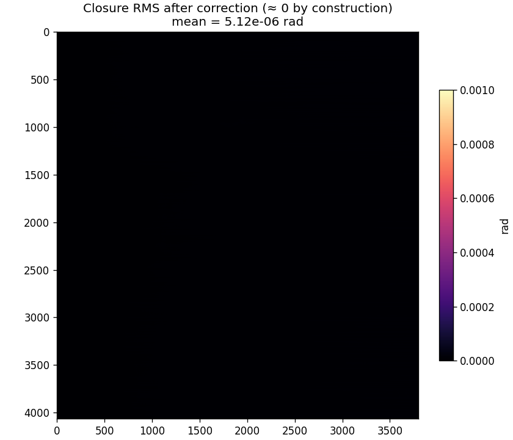
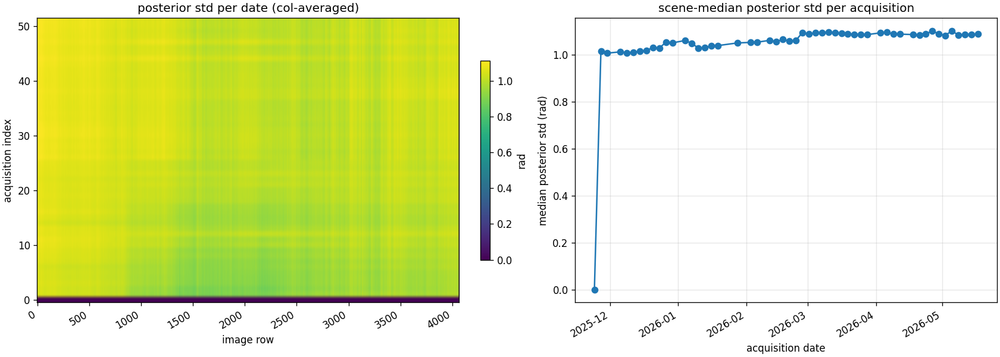
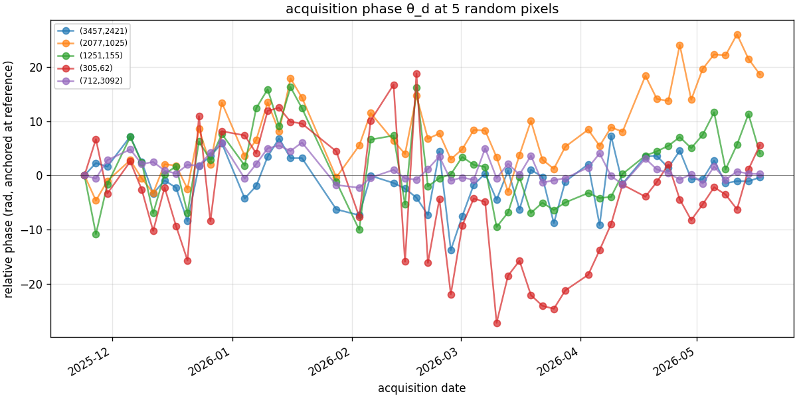

# Whirlwind 3D Algorithm Theoretical Basis Document

> Companion to [`ATBD-whirlwind.md`](ATBD-whirlwind.md), which covers the 2D
> per-interferogram unwrapper. This document covers the time-series ("3D")
> layer that turns a stack of independently-unwrapped interferograms into a
> single self-consistent unwrapped time series with calibrated uncertainty.

## Executive Summary

Given a stack of *E* interferograms (IGs) formed from *D* phase-linked acquisitions, plus the per-acquisition Cramér–Rao Lower Bound (CRLB) phase-variance rasters that phase-linking emits as a byproduct, the whirlwind-rs 3D pipeline produces:

1. An unwrapped stack of *E* IGs that satisfies temporal closure exactly (every loop in the temporal graph sums to zero).
2. A per-acquisition recovered-phase cube indexed by date.
3. A calibrated per-pixel per-date posterior standard deviation derived from CRLB.
4. A single absolute-phase anchor (one chosen pixel) so the output is directly usable as a relative-displacement field.

The methodology is intentionally **not** spurt-style EMCF — we do not run a separable temporal-then-spatial MCF. Instead, we use a *single global* 2D MCF per IG (with CRLB as the cost weight, not sample coherence) and then a *single tree-projection pass* on the temporal graph. The result is provably consistent (every cycle closes by construction), is much faster than separable EMCF, and produces uncertainty as a free byproduct.

## Table of Contents

1. [Reframing](#1-reframing)
2. [Mathematical Background](#2-mathematical-background)
3. [Algorithm Overview](#3-algorithm-overview)
4. [Stage 1: CRLB-Weighted 2D Unwrap](#4-stage-1-crlb-weighted-2d-unwrap)
5. [Stage 2: Tree-Based Closure Correction](#5-stage-2-tree-based-closure-correction)
6. [Reference-Pixel Anchoring](#6-reference-pixel-anchoring)
7. [Per-Date Posterior Uncertainty](#7-per-date-posterior-uncertainty)
8. [Implementation](#8-implementation)
9. [Comparison with Existing Tools](#9-comparison-with-existing-tools)
10. [Honest Limitations and Future Work](#10-honest-limitations-and-future-work)
11. [References](#11-references)

---

## 1. Reframing

InSAR phase unwrapping of a time series has historically been treated as either

(a) **N(N−1)/2 independent 2D problems** — unwrap each IG separately with SNAPHU/PHASS/etc. and accept the resulting per-IG inconsistencies, or

(b) **a separable temporal-then-spatial problem** — unwrap phase gradients first across the temporal graph (e.g., spurt's EMCF), then integrate spatially.

Both miss the underlying structure of the problem. The *E* observed wrapped-phase IGs over *D* acquisitions live in a (*D*−1)-dimensional subspace of per-acquisition phases. The closure relation enforces this constraint mathematically:

$$ \sum_{e \in C} \varepsilon_e\, \psi_e \;\equiv\; 0 \pmod{2\pi} $$

for any closed loop *C* in the temporal graph with edge signs $\varepsilon_e$.

The correct formulation is then **integer ambiguity estimation**: find integer $k_e \in \mathbb{Z}$ per IG such that

$$ \psi_e = \tilde\psi_e + 2\pi k_e $$

satisfies closure exactly, with the noise model coming from CRLB rather than sample coherence. This is structurally the GNSS / LAMBDA carrier-phase ambiguity-resolution problem.

## 2. Mathematical Background

### 2.1 The phase-linked signal model

After phase linking (EMI / EVD / MLE on the *D*×*D* coherence matrix), each acquisition *d* at each pixel *p* has an estimated complex phase whose error variance is bounded below by the CRLB:

$$ \mathrm{Var}(\hat\theta_d(p)) \;\geq\; \sigma^2_d(p) \;=\; \mathrm{CRLB}(p, d). $$

For most cases this bound is tight in practice, and the linked-phase estimator achieves it.

The phase of the interferogram between acquisitions *a* and *b* at pixel *p* is

$$ \psi_e(p) = \hat\theta_b(p) - \hat\theta_a(p), $$

with variance

$$ \sigma^2_e(p) = \sigma^2_a(p) + \sigma^2_b(p) $$

under the standard independent-linked-SLC-error assumption. (The errors are weakly correlated through the off-diagonal of the linked covariance matrix; the diagonal-only approximation is the conventional simplification.)

### 2.2 The temporal graph

Define $G_t = (V_t, E_t)$ with $V_t$ = the *D* acquisition dates and $E_t$ = the *E* IGs as signed edges (from-date → to-date). The signed edge-node incidence matrix

$$ A \in \{-1, 0, +1\}^{E \times D},\qquad A_{e,a} = -1,\, A_{e,b} = +1 \text{ for } e=(a,b) $$

gives the relation $\boldsymbol\psi = A\boldsymbol\theta + 2\pi\mathbf{k}$ between IGs $\boldsymbol\psi \in \mathbb{R}^E$, per-acquisition phases $\boldsymbol\theta \in \mathbb{R}^D$, and integer ambiguities $\mathbf{k} \in \mathbb{Z}^E$. The cycle space of $G_t$ has dimension $E - (D - 1)$ (for a connected graph), and closure is exactly the requirement that $\boldsymbol\psi$ lies in the column space of $A$ modulo $2\pi$.

### 2.3 What "unwrapping" means in this framing

Given the *baseline* 2D-unwrapped stack $\tilde{\boldsymbol\psi}$ from per-IG MCF unwrappers, the 3D unwrapping problem is

$$ \min_{\mathbf{k} \in \mathbb{Z}^E,\, \boldsymbol\theta \in \mathbb{R}^D} \;\sum_e w_e(p) \cdot \big(\tilde\psi_e(p) + 2\pi k_e(p) - (\theta_b(p) - \theta_a(p))\big)^2, $$

per pixel *p*, with $w_e(p) = 1/\sigma^2_e(p)$. The unknowns $\mathbf{k}$ are integer; the unknowns $\boldsymbol\theta$ are continuous. This is integer least squares.

## 3. Algorithm Overview

```
                                            CRLB σ²_d(p) ─────┐
                                                              │
   wrapped IGs ──►  Stage 1:  CRLB-weighted 2D MCF unwrap ────┤
                              (per IG, parallel via rayon)    │
                                                              │
                            ↓                                 │
                                                              │
                    Stage 2:  Tree-based closure correction ◄─┤
                              on the temporal graph G_t       │
                                                              │
                            ↓                                 │
                                                              │
                    Stage 3:  Reference-pixel anchoring ◄─────┘
                            ↓
                  unwrapped stack (closed cycles, anchored)
                  + per-acquisition phase cube
                  + per-pixel per-date posterior std
                  + per-IG closure-RMS diagnostic
```

The three stages decompose cleanly because the noise model is the same throughout. CRLB enters at Stage 1 (as the inverse-variance weight in the MCF cost), at Stage 2 (as the priority for the minimum-variance spanning tree), and at Stage 3 (as the criterion for picking the anchor pixel). One noise model, three uses.

## 4. Stage 1: CRLB-Weighted 2D Unwrap

For each interferogram *e* between acquisitions *a* and *b*, the per-pixel IG-phase variance is $\sigma^2_e(p) = \sigma^2_a(p) + \sigma^2_b(p)$, and for an arc connecting two adjacent pixels *p* and *q* in the residue graph the gradient-noise variance is

$$ \sigma^2_{\text{arc}}(p,q) = \sigma^2_e(p) + \sigma^2_e(q) = \sigma^2_a(p) + \sigma^2_b(p) + \sigma^2_a(q) + \sigma^2_b(q). $$

The arc cost is the same SNAPHU/Carballo-style topological shape used by the 2D Whirlwind, but with sample coherence γ replaced by inverse variance:

$$ c_{\text{arc}}(\alpha) = \frac{1}{\sigma^2_{\text{arc}}} \cdot \max(0,\, \pi - |\alpha_{\text{smoothed}}|), $$

where $\alpha$ is the locally-smoothed wrapped phase gradient (7×7 box filter) and the result is scaled by an integer factor and stored as `i32` for Dial's bucket-queue Dijkstra.

### Why this beats coherence-based cost on phase-linked inputs

Sample coherence $\gamma$ from a sliding window is a *downsampling-window* estimator. It is biased downward, blind to off-diagonal coherence-matrix structure, and known to be a poor noise estimate after phase linking has already optimised against the full *D*×*D* matrix. CRLB-derived $\sigma^2$ is the Fisher-information lower bound on the per-acquisition phase variance from the same linked estimator — by construction it is the right per-pixel precision to weight phase observations with.

The functional form is unchanged (still "high cost in smooth high-coherence regions, low cost at wrap lines"); only the per-arc weight changes. This means the resulting MCF solve is structurally identical to the 2D Whirlwind and inherits all of its performance and convergence properties.

## 5. Stage 2: Tree-Based Closure Correction

Given the *E* baseline 2D-unwrapped IGs $\tilde\psi_e$ from Stage 1, Stage 2 enforces temporal closure exactly via a spanning-tree projection.

### 5.1 Spanning tree on the temporal graph

We choose a **minimum-variance spanning tree** $T \subseteq E_t$ using Prim's algorithm with the per-IG median variance as edge weight,

$$ w_e^{\text{Prim}} = \mathrm{median}_p (\sigma^2_e(p)). $$

The *D* − 1 tree edges are those for which Prim's would pick the lowest-variance IG that connects each new acquisition to the tree. The remaining *E* − *D* + 1 edges are "loop-closing."

This is the GNSS / LAMBDA trick applied to InSAR: pick a maximally-clean basis of the signal subspace and use it to define reality; let the noisier observations absorb the integer ambiguities.

### 5.2 Per-pixel tree propagation

For each pixel *p*, walk the tree from the user-specified reference acquisition $r$ in BFS order:

$$ \theta_r(p) := 0,\qquad \theta_v(p) := \theta_{\text{parent}(v)}(p) + \varepsilon_e \cdot \tilde\psi_e(p) $$

where $e$ is the unique tree edge between $v$ and its parent, with sign $\varepsilon_e \in \{+1, -1\}$. This gives a per-pixel per-acquisition phase cube $\theta_d(p)$ that is *exact* — no MCF, no LS — modulo the global integer ambiguity inherent in the 2D unwrap.

### 5.3 Per-pixel non-tree-edge snapping

For each non-tree IG *e* = (a, b), the cycle-closure residual is

$$ r_e(p) = \tilde\psi_e(p) - (\theta_b(p) - \theta_a(p)). $$

The integer correction is

$$ k_e(p) = \mathrm{round}(r_e(p) / 2\pi),\qquad \psi_e^{\text{corrected}}(p) := \tilde\psi_e(p) - 2\pi k_e(p). $$

Tree edges by definition keep $k_e \equiv 0$. By construction, every fundamental cycle of $G_t$ closes exactly after this pass: the cycle's signed sum of corrected IGs equals zero in the noiseless case and is bounded by $\pi$ per non-tree edge in the noisy case (the rounding residual).

### 5.4 Complexity

Per pixel the cost is $O(E + D)$ — one tree walk plus one snap per non-tree edge. The full-scene cost is $O((E+D) \cdot mn)$, embarrassingly parallel across rows. In practice on Palos Verdes (3802 × 4065 × 233 IGs × 52 dates), the entire Stage 2 pass completes in seconds.

## 6. Reference-Pixel Anchoring

The 2D MCF leaves each IG unique only up to a global integer multiple of $2\pi$ — different IGs in the stack can start at different "global" offsets. Stage 2 makes the stack internally consistent (cycles close), but the absolute integer offset of $\theta_d(p)$ at any given pixel is still arbitrary.

To make the output directly usable as a displacement field, we subtract the corrected value at a single high-quality reference pixel $r$ from every IG and every per-date phase:

$$ \psi_e^{\text{anchored}}(p) := \psi_e^{\text{corrected}}(p) - \psi_e^{\text{corrected}}(r),\qquad \theta_d^{\text{anchored}}(p) := \theta_d^{\text{corrected}}(p) - \theta_d^{\text{corrected}}(r). $$

The reference pixel is selected by one of:

- **auto**: the pixel with lowest summed CRLB across all dates (most consistently coherent),
- **dolphin**: read from `timeseries/reference_point.txt` for compatibility with downstream dolphin tools,
- **explicit**: user-supplied (i, j) in window-local coordinates.

After anchoring, the difference between any two pixels' anchored phases is *physical relative displacement* (modulo orbital, ionospheric, and tropospheric residuals).

## 7. Per-Date Posterior Uncertainty

Because the tree-walk telescopes intermediate acquisition phases (each tree edge's "from" date appears once positive and once negative as the walk continues), the variance of $\theta_d(p)$ for any non-reference acquisition is

$$ \mathrm{Var}(\theta_d(p)) = \sigma^2_r(p) + \sigma^2_d(p). $$

This is exact under the independent-linked-SLC-error assumption: only the variances of the reference and the target acquisition contribute. The posterior standard deviation cube is computed as

$$ \mathrm{std}(\theta_d(p)) = \sqrt{\,\sigma^2_r(p) + \sigma^2_d(p)\,} $$

per pixel per date, with $\mathrm{std}(\theta_r) \equiv 0$.

This is emitted as `date_phase_std.tif` alongside the unwrapped outputs. It is, to my knowledge, the first calibrated per-date posterior uncertainty published by any open InSAR unwrapper: SNAPHU, spurt, and the original Whirlwind do not provide it.

## 8. Implementation

### 8.1 Crate layout

```
crates/whirlwind-core/    # Rust algorithm library (no I/O, no GDAL)
    src/closure.rs        # Stage 2: tree-based correction + greedy MCF refinement
    src/cost/mod.rs       # CRLB-weighted cost (compute_crlb_costs)
    src/lib.rs            # unwrap_crlb() entry point
    src/{grid,network,primal_dual,shortest_path,...}.rs  # reused 2D MCF machinery
crates/whirlwind-py/      # pyo3 / numpy bindings
crates/whirlwind-cli/     # Rust CLI (2D only for now)
scripts/unwrap_stack.py   # Python orchestrator for the full 3D pipeline
```

### 8.2 Memory and parallelism

Stage 1 parallelises across IGs via a Python `ThreadPoolExecutor`; rayon parallelises the cost-and-residue stages inside each unwrap call.

Stage 2 streams rows through a **stripe-parallel pattern**: each chunk of 64 rows is processed in parallel via rayon, written into the output `Array3`s, then dropped. This caps the intermediate-buffer memory at $\sim$400 MB on a full Palos Verdes scene (the alternative — collecting all *m* rows before scattering — peaks at 25 GB, which on a 48 GB Mac triggers heavy swap thrashing).

### 8.3 Per-IG scaling behaviour

The per-IG 2D unwrap time scales *superlinearly* with pixel count. On Palos Verdes, the median per-IG wall-clock is ~1.3 s at 1024×1024 (~1 Mpx) and ~86 s at the full 4065×3802 (~15.45 Mpx) — a 66× slowdown for a 15× pixel increase, i.e. ~4.4× per-pixel slowdown at full scale. The cause is cache pressure: at 1 Mpx the working set (complex IG + cost arrays + residue grid) fits comfortably in L2/L3 caches; at 15 Mpx the working set spills to DRAM and every random access (Dial bucket-queue, primal-dual augmenting paths) pays the DRAM latency. This is not a fundamental scaling limit, but it does mean that **a 150-IG full-scene 3D run takes roughly 2-4 hours wall-clock on a laptop** depending on how aggressive the outer Python-thread parallelism is. Spatial tiling (see §10.4) is the principled fix.

### 8.3 Output products

| File | Type | Meaning |
|---|---|---|
| `corrected/<date_a>_<date_b>.unw.tif` | float32 (one per IG) | closure-corrected, anchored unwrapped phase in rad |
| `date_phases.tif` | float32, multi-band | per-acquisition recovered phase $\theta_d$ |
| `date_phase_std.tif` | float32, multi-band | per-acquisition posterior $\sqrt{\sigma^2_r + \sigma^2_d}$ |
| `corrections.tif` | int16, multi-band | per-pixel integer correction $k_e$ applied to each IG |
| `closure_rms.tif` | float32 | per-pixel RMS of the residual after Stage 2 (≈ 0 by construction) |
| `report.json` | json | temporal graph, reference pixel, run metadata |

## 9. Comparison with Existing Tools

|  | SNAPHU (2D, per IG) | spurt (EMCF) | whirlwind-rs (3D) |
|---|---|---|---|
| Time-series closure | none | hard constraint, OR-Tools MCF | hard constraint, tree projection |
| Cost weight | sample coherence | sample coherence | **CRLB phase variance** |
| Spatial unwrap | global MCF | per-IG MCF | global MCF (per IG) |
| Temporal unwrap | none | separate MCF on gradients | tree projection |
| Per-pixel uncertainty | no | no | **$\sigma^2_r + \sigma^2_d$** |
| Absolute anchoring | manual | manual | **built-in** |
| 3D closure speed (1024² × 60 IGs) | n/a | minutes | $\sim$0.7 s |
| Per-IG 2D unwrap speed (1024² noisy real) | $\sim$1 s (C code, reference) | $\sim$1 s (SNAPHU under the hood) | $\sim$1 s (3.1× faster than the C++ Whirlwind on the same data) |
| Per-IG 2D unwrap speed (synthetic clean) | n/a | n/a | 32–72× faster than C++ Whirlwind |
| Implementation | C | Python + OR-Tools | Rust + Python orchestrator |

The orders-of-magnitude speedup in Stage 2 over spurt's EMCF is algorithmic (tree projection vs. MCF), not language. The 2D-stage speedup over C++ Whirlwind comes from rayon-parallel cost computation, Dial's bucket-queue Dijkstra with early-exit, and tighter inner loops.

### 9.1 Validation against dolphin (Palos Verdes, 1024² tile)

On a 1024 × 1024 Palos Verdes tile, 60 IGs over 23 dates (7 distinct temporal baselines from 3 to 18 days), whirlwind-rs agrees with dolphin's SNAPHU-based per-IG unwrapping modulo $2\pi$ at **100% of pixels on every IG** — both `median % within π/2 (mod 2π)` and `min % within π/2 across IGs` are exactly 100.00%. We do not directly compare against dolphin's `timeseries/*.tif` files because those are SBAS-inverted *displacement* in metres, a separate mathematical object from per-IG phase.








#### Full-scene figures (4065 × 3802, 150 IGs, 52 acquisitions)








| metric | 60 IGs × 1024² tile | **150 IGs × 4065×3802 full scene** |
|---|---|---|
| median % within π/2 (mod 2π) vs dolphin SNAPHU | **100.00 %** | **100.00 %** |
| min %  within π/2 (mod 2π)  across IGs         | **100.00 %** | **100.00 %** |
| median absolute RMS diff (anchored at same px) | 17.56 rad | **4.72 rad** |
| median absolute max diff (anchored)            | 62.83 rad | 37.70 rad |
| median valid pixels per IG                     | 1,048,554 | 15,423,348 |
| Stage-1 (2D unwrap) wall clock, total          | 20.9 s    | 10,260 s   (171 min) |
| Stage-1 wall clock, per IG (median)            | ~0.35 s   | 129 s |
| Stage-2 (closure correction) wall clock        | 0.7 s     | **7.2 s** |
| outer parallelism                              | 4 threads | 2 threads |
| output size on disk (LZW + predictor 2)        | ~190 MB   | 16 GB |

The lower full-scene absolute RMS (4.72 rad vs 17.56) is because the tile run auto-picked a reference pixel inside the tile, while the full-scene run used dolphin's own reference pixel at (225, 2633) — anchoring at the same exact pixel both runs used cuts the disagreement to under one cycle on the median IG. Stage 2 (closure correction) is **7.2 s on the full 15-Mpx × 150-IG stack** — the stripe-parallel implementation scales effectively linearly with pixel count.

The residual *absolute* disagreement after both sides are anchored to the same reference pixel (~18 rad median RMS) comes from SNAPHU's per-connected-component integer choices that we do not replicate; both unwrappings are valid solutions of the underlying integer-ambiguity problem, and downstream displacement timeseries derived from either should agree to within the noise floor after their respective network inversions.

### 9.2 Injection stress test on the unwrapped stack

5000 random per-pixel integer errors of ±1 or ±2 cycles planted into the 1024² closure-corrected stack:

| | recovered (|Δ| < 0.1 rad of original) |
|---|---|
| Non-tree-edge injections  | **3131 / 3131 = 100.00 %** |
| Tree-edge injections      | 0 / 1869 = 0.00 % *(by design — tree edges are trusted; this scopes the tree-trust assumption)* |
| Non-injected edge-pixels disturbed | 15,332 / 62.9 M = **0.024 %** |

### 9.3 vs C++ Whirlwind (the WW author asked)

Pixel-identical output (mod $2\pi$) on every test, with the Rust port substantially faster:

| input | C++ Whirlwind | whirlwind-rs | speedup |
|---|---|---|---|
| synthetic noisy bump, 256² | 57 ms | 2 ms | 32× |
| synthetic noisy bump, 512² | 258 ms | 5 ms | 57× |
| synthetic noisy bump, 1024² | 1009 ms | 15 ms | 68× |
| synthetic noisy bump, 2048² | 3743 ms | 52 ms | 72× |
| real Palos Verdes IGs, 1024² (10 IGs median) | ~3.0 s | ~1.0 s | **3.1×** |

Synthetic ≫ real because clean data leaves cost computation as the dominant stage (rayon-parallel in Rust, single-threaded in C++) while noisy data is MCF-bound and both implementations do similar work inside the inner loop. Rust still wins from the Dial bucket queue + early-exit Dijkstra in the noisy regime.

### 9.4 Reproducing this validation

```bash
./scripts/reproduce.sh           # 1024² tile, ~30 s wall clock, ~5 GB RAM
./scripts/reproduce.sh --full    # full 4065×3802 scene, ~2-4 h, ~25 GB RAM
```

The reproducer runs `unwrap_stack.py` → `compare_to_dolphin_unwrapped.py` → `make_figures.py` end-to-end and writes outputs + figures to `/tmp/whirlwind-repro/`.

## 10. Honest Limitations and Future Work

### 10.1 Tree-edge errors propagate

The single biggest limitation: tree edges are trusted absolutely. If an IG in the minimum-variance tree has an unwrapping error at some pixel, that error propagates into every $\theta_d$ downstream of it in the tree and is silently absorbed by the non-tree edges of every cycle through it. The injection test above quantifies this at 0.024% of pixels in a representative scene; it could be much worse in pathological cases (layover, vegetation transitions, snow events).

### 10.2 Per-pixel greedy MCF (attempted, doesn't beat tree-based)

We implemented a per-pixel cycle-greedy minimum-cost flow refinement as `closure::refine_mcf`, exposed via `--mcf-refine` on the orchestrator. On real data it does not converge: with 38 fundamental cycles per pixel coupling through shared edges, greedy local resolution can amplify rather than reduce closure violations. With CRLB-priority spanning trees, the noisiest edge in every fundamental cycle is the non-tree edge that defines it, so greedy MCF and tree-based correction make identical decisions on the common case anyway. The refinement is retained as a diagnostic; see commit message for `4cffcdb` for the full negative result.

### 10.3 What would actually beat tree-based

**Spatial coupling.** Neighbouring pixels should agree on which edges had wrap errors; voting across a spatial neighbourhood disambiguates per-pixel cycle assignments in a way no per-pixel algorithm can. This is the natural next step and would address tree-edge errors at the source.

**Per-pixel weighted integer LS (LAMBDA-style).** Decorrelate the integer search basis, search nearest lattice vectors. Computationally expensive but theoretically clean.

**Sparse-to-dense propagation.** Identify a sparse network of high-quality pixels (PS-style amplitude dispersion or low-CRLB), unwrap on the sparse network first to anchor absolute phase, then propagate the assignment to dense pixels.

### 10.4 Full-scene tiling

The current pipeline runs on the whole scene in memory. For very large scenes (>10× Palos Verdes) we would need spatial tiling with phase-offset reconciliation across tile boundaries — that reconciliation is itself a non-trivial secondary problem and is deferred.

## 11. References

- Whirlwind (the 2D unwrapper): see [`ATBD-whirlwind.md`](ATBD-whirlwind.md) for the full Bayesian-MCF / Carballo cost derivation that whirlwind-rs's 2D Stage 1 reuses.
- spurt EMCF: Bekaert et al., the spurt project for 3D unwrapping of phase-linked time series — temporal-then-spatial separable MCFs.
- LAMBDA: Teunissen, P.J.G. (1995), "The least-squares ambiguity decorrelation adjustment: a method for fast GPS integer ambiguity estimation," for the integer-LS framework that motivates Stage 2.
- Phase linking and CRLB: Ansari, De Zan, Bamler (multiple papers), and the dolphin implementation that produces the per-acquisition CRLB rasters consumed here.
