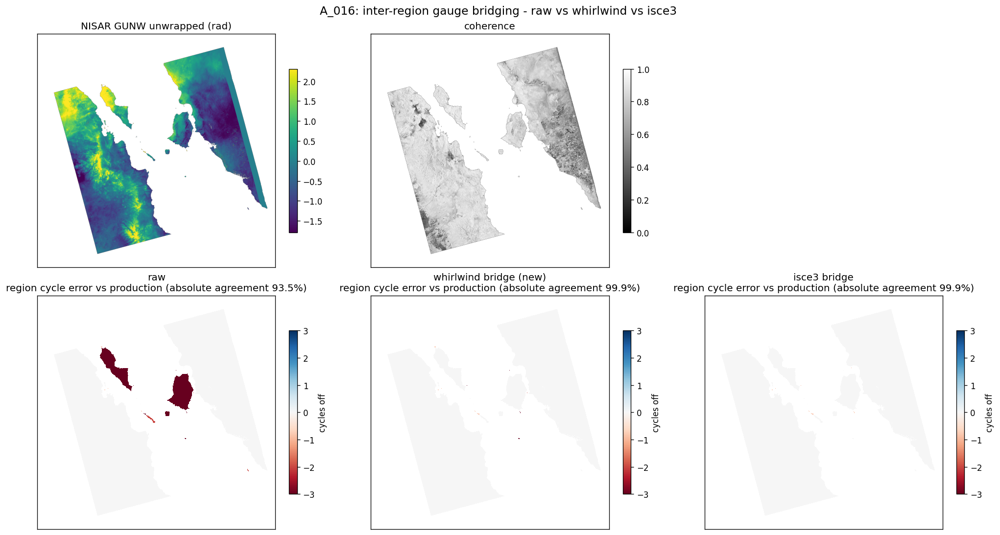

# Bridging disconnected regions

When a river, water body, subswath seam, or other low-coherence gap splits the valid mask, the MCF solve unwraps each side independently. The wrapped phase does not contain the integer 2π offset between disconnected regions. After integration, each region is internally consistent, but may be one or more cycles above or below another.

Bridging estimates one integer-cycle shift per region and applies it after unwrap. In Whirlwind it is enabled by default in [`unwrap`](ALGORITHM.md), and can also be run directly with `whirlwind.bridge_components`.

## Why component scores miss it


## The model

Let the valid mask split into integration regions $R_1, \dots, R_K$ (the 4-connected components of the mask, which the integrator seeds independently).  Within a region, the MCF flow fixes the relative 2π level. Between regions, the integer level is unobserved. Bridging chooses one integer shift $s_i$ per region,

$$ u'(p) = u(p) + 2\pi\, s_i \quad \text{for } p \in R_i, $$

and fixes the largest region as the reference ($s_\text{ref} = 0$).

## Algorithm

Whirlwind uses a pure-NumPy port of the algorithm in isce3's NISAR GUNW workflow (`isce3.unwrap.bridge_phase.bridge_unwrapped_phase`):

1. Label the integration regions (the native `label_components`, a 4-connected BFS — no scipy). Keep regions of at least `min_px` pixels.
2. For every pair of regions, find the closest pair of boundary pixels.  Boundary-pixel sets are strided to at most `max_boundary` points for the nearest-pair search.
3. Build a minimum spanning tree over those closest-pair distances, rooted at the largest region. Each region is referenced through a nearby neighbor rather than directly to a single global anchor; the shifts compose along the tree.
4. Walk the tree outward from the root. For each edge, take the median unwrapped phase in a local box around each bridge endpoint (half-width `radius`, clamped to a scene-relative size), round the parent-to-child difference to integer cycles, and add that shift to the child region. The parent is already corrected when the child is processed, so corrections propagate through the tree.

A single-region (or coherently connected) frame produces no bridges and is returned byte-identical.

The method reads phase locally at the region boundaries, where the cross-gap phase difference is smallest, and propagates offsets along a spanning tree, so distant regions chain through nearby neighbors. Whole-region medians can be biased by residual ramps and round to the wrong integer offset.

## Results

Absolute inter-region agreement with the production NISAR GUNW unwrap on the 13-frame set (`scripts/diag_bridge_isce3_compare.py all`):

| Frame | no bridge | whirlwind bridge | isce3 bridge |
| ----- | --------: | ---------------: | -----------: |
| A_016 |      93.5 |             99.9 |         99.9 |
| A_018 |      99.5 |             99.9 |         99.9 |
| A_025 |      46.2 |             99.9 |         70.3 |
| A_030 |      98.3 |             99.9 |         98.3 |

The other nine frames are single-region (bridging is a no-op) or already consistent. Whirlwind matches isce3 on A_016 / A_018. On A_025 (a low-coherence river) and A_030, Whirlwind corrects regions that remain mis-levelled with the isce3 settings used here. The post-pass needs only the unwrapped phase and mask; it does not need scipy or a coherence raster.

The script removes one global offset, taken as the median cycle of the largest region, then counts valid pixels on the same integer cycle as the reference unwrap.



The bottom row colors each region by integer cycle error versus production (0 = correct). Without bridging, the two large regions are −3 cycles off; the Whirlwind and isce3 bridges both bring them to zero.

## Reproduce

```bash
# absolute-metric comparison vs isce3, one or all frames
python scripts/diag_bridge_isce3_compare.py A_016
python scripts/diag_bridge_isce3_compare.py all
# figure
python scripts/plot_bridge_compare.py A_016
```
