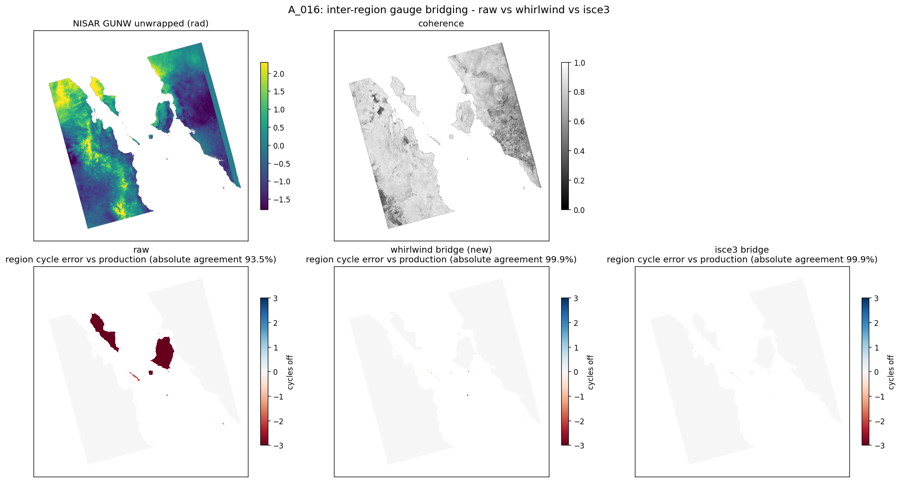

# Bridging disconnected regions

When the valid mask splits the scene into separate pieces (islands, land on either side of a masked river, subswath gaps, missing tiles), the wrapped phase says nothing about the 2π offset between the pieces. The solver unwraps each piece correctly on its own, but one piece may end up a whole number of cycles above or below another.

Bridging is a post-processing step that estimates one integer-cycle shift per region. It is on by default in `unwrap` (`bridge=True`) and can also be run on its own with `whirlwind.bridge_components(unw, mask)`.

## The model

Let the valid mask split into 4-connected regions $R_1, \dots, R_K$. Bridging chooses one integer shift $s_i$ per region,

$$ u'(p) = u(p) + 2\pi\, s_i \quad \text{for } p \in R_i, $$

and fixes the largest region as the reference ($s_\text{ref} = 0$).

## Algorithm

The method follows the bridging step in ISCE3's NISAR GUNW workflow and in MintPy, with two changes that matter for scenes with strong phase gradients:

1. Label the regions and keep those with at least `min_px` pixels.
2. For every pair of regions, find the closest pair of boundary pixels.
3. Visit regions from largest to smallest. Attach each one to its nearest already-visited region, which is therefore at least as large. This stops a small island from setting the level of a much larger landmass.
4. For each attachment, take the median unwrapped phase in a small box (32-pixel half-width) around each of the two boundary pixels. Round the difference to whole cycles and apply that shift to the child region. Parents are processed before children, so shifts propagate down the tree.

Reading the phase in a small box right at the gap keeps the estimate local, where the true phase difference across the gap is smallest. Whole-region medians, or large windows on scenes with strong ionospheric ramps, can span several fringes and round a real gradient into a false integer offset.

A scene whose mask is a single connected region needs no bridging and is returned unchanged.



*NISAR frame split by masked water. The bottom row colors each region by its integer-cycle error against the production unwrap (0 = correct). Without bridging, the two large regions are off by −3 cycles. With bridging they are level.*

## Wide or regular gaps: `connect_gaps`

Bridging only sees the unwrapped phase at the two ends of each gap. Some gaps are regular stripes of nodata, such as the transmit gaps between NISAR fixed-PRF subswaths. For those it can work better to let the solver see across the gap:

```python
unw, conncomp = ww.unwrap(igram, corr, nlooks, mask=mask, connect_gaps=True)
```

`connect_gaps` fills each nodata run of up to `connect_gaps_max_px` pixels with a low-confidence phase path. The path extends the local phase slope from both sides of the gap. The solver then levels the regions as part of the main solve, and the filled pixels are removed from both outputs afterwards. Unlike `interpolate`, it keeps the fringe count across the gap, which an average of wrapped phasors cannot do. This option is Python-only for now.
