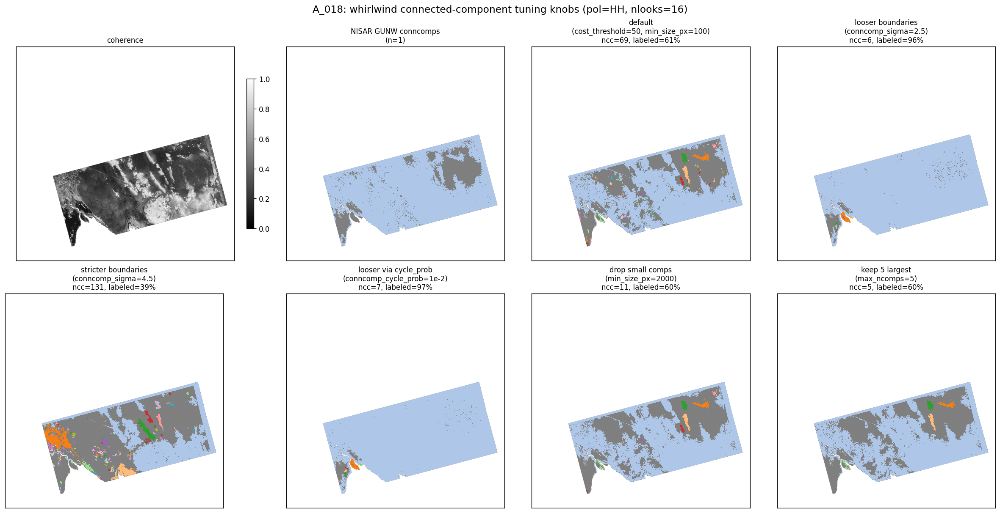

# Tuning connected components

`whirlwind.unwrap` returns two arrays: the unwrapped phase and a **connected
component** (conncomp) label map, analogous to SNAPHU's. Each positive integer
marks a region the solver believes is unwrapped self-consistently; `0` is
background / dropped. This page explains the knobs that shape that label map and
shows what each one does on a real frame.

If you only remember one thing: **a component boundary is drawn across an edge
whose statistical cost is low** (an unreliable edge, where a one-cycle slip is
plausible). Stricter settings draw more boundaries, giving more but smaller and
"safer" components; looser settings merge them into fewer, larger ones.

## The knobs

All are keyword arguments to [`unwrap`](ALGORITHM.md):

| Knob | What it does | Direction |
|---|---|---|
| `cost_threshold` (int, default 50) | Raw threshold: an edge becomes a boundary when its cost is `<= cost_threshold`. | higher → more boundaries (smaller comps) |
| `conncomp_sigma` (float) | Set `cost_threshold` from a Gaussian-equivalent noise level. `~3.5` reproduces the default 50. | higher → stricter (more boundaries) |
| `conncomp_cycle_prob` (float) | Set `cost_threshold` from a target per-edge one-cycle-correction probability. `~2.4e-4` matches the default. | lower → stricter (more boundaries) |
| `min_size_px` (int, default 100) | Discard components smaller than this many pixels. | higher → fewer comps |
| `max_ncomps` (int, default 1024) | Keep only the N largest components. | lower → fewer comps |

**Prefer the physical knobs over `cost_threshold`.** `conncomp_sigma` and
`conncomp_cycle_prob` are two views of the same threshold expressed in units you
can reason about (a noise sigma, or a per-edge slip probability) rather than raw
cost. If you pass more than one, precedence is
`conncomp_sigma` > `conncomp_cycle_prob` > `cost_threshold`.

`conncomp_sigma` / `conncomp_cycle_prob` change *where boundaries fall* (they
feed the cost-based component growing). `min_size_px` / `max_ncomps` are
*size filters* applied to the resulting components. Reach for the size filters
when the boundaries are where you want them but you simply have too many tiny
islands; reach for sigma/cycle_prob when whole regions are over- or
under-segmented.

> Note: there is intentionally **no** "coherence floor" knob. Masking out pixels
> below some coherence is just `cc[corr < floor] = 0`, which you can apply to the
> returned labels yourself; it tells you nothing the unwrapper has to know, so it
> is not part of the API. The cost-based knobs above *are* integrated into the
> component growing.

## Worked example: A_018

A_018 is a good stress case: a large, genuinely decorrelated area (43 % of valid
pixels have coherence below 0.3) gets peppered with small components under the
default settings. The figure runs one `unwrap` per setting:



| Setting | # components | labeled % of valid | # comps < 2 k px |
|---|---:|---:|---:|
| default (`cost_threshold=50`, `min_size_px=100`) | 69 | 61 | 58 |
| `conncomp_sigma=2.5` (looser) | 6 | 97 | 3 |
| `conncomp_sigma=4.5` (stricter) | 131 | 39 | 104 |
| `conncomp_cycle_prob=1e-2` (looser) | 7 | 97 | 2 |
| `min_size_px=2000` | 11 | 60 | 0 |
| `max_ncomps=5` | 5 | 60 | 0 |

Reading it:

- **Default** leaves 58 small components (the orange speckle) scattered through
  the decorrelated area — each is a little patch the solver isolated because the
  edges around it are unreliable.
- **Loosening** (`conncomp_sigma=2.5` or `conncomp_cycle_prob=1e-2`) draws far
  fewer boundaries, so the speckle merges into a handful of large components and
  the labeled fraction jumps to ~97 %. Use this when you trust the phase and want
  broad regions; the risk is that a real slip inside a merged region goes
  unflagged.
- **Tightening** (`conncomp_sigma=4.5`) does the opposite — 131 components, only
  39 % labeled. Use it when you want only the most internally-consistent cores.
- **To simply drop the small decorrelated islands** while leaving the good
  regions exactly as they are, use a size filter: `min_size_px=2000` removes all
  58 small components (69 → 11) without changing coverage, and `max_ncomps=5`
  keeps just the five biggest. This is usually what you want for "clean up the
  speckle in the decorrelated area."

## Recipes

- Too many tiny components, good regions are fine → raise `min_size_px` (or set
  `max_ncomps`).
- Whole scene over-segmented (regions that should be one are split) → lower
  `conncomp_sigma` (e.g. 2.5–3.0) or raise `conncomp_cycle_prob`.
- Want only high-confidence cores → raise `conncomp_sigma` (e.g. 4.5+).
- Want to mask by coherence → do it on the returned labels:
  `cc[corr < 0.3] = 0`.

## Reproduce

```bash
python scripts/sweep_conncomp_knobs.py A_018
```
