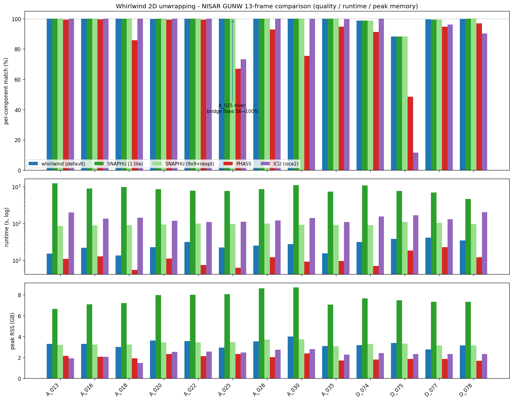

# NISAR 2D unwrapping comparison

This page compares Whirlwind with the unwrapping used in NISAR GUNW products and with a few other 2D unwrappers. The metric is agreement with the production NISAR unwrapped phase after re-wrapping it to create the input wrapped phase.

The comparison uses 13 HH NISAR GUNW frames with `nlooks=16`. Runtimes and memory are from one Apple M-series laptop, so treat them as relative numbers rather than universal benchmarks.

## Summary

- Whirlwind agrees with the production SNAPHU unwrap on at least 98.8 percent of pixels on 12 of 13 frames (99 percent or better on 11 of them).
- The remaining frame, D_075, is difficult for every method in this sweep; Whirlwind agrees with production SNAPHU on 88.2 percent of pixels there, while PHASS agrees on 48.4 percent.
- Runtime is 10-27 seconds per frame for Whirlwind, compared with 465-1242 seconds for single-tile SNAPHU and about 100-200 seconds for SNAPHU 3x3 tiled (9 tiles in parallel) plus reoptimization.
- Peak memory is about 2.5 GB per NISAR frame for Whirlwind (2.2-2.8 GB), compared with about 8 GB for single-tile SNAPHU and about 6-13 GB for 3x3 tiled SNAPHU. The tiled peak is not intrinsic: it is dominated by the parallel tile phase, so it scales with how many tiles unwrap at once (`nproc`) -- capping concurrency roughly halves it (see the note under the table).

## Metric

The quality number is per-connected-component 2pi ambiguity agreement with the production GUNW unwrap, after median alignment within each component. This checks whether the integer cycle field agrees with the production result while avoiding a single global reference-pixel offset dominating the score.

## Results

| Frame | Whirlwind vs production SNAPHU | PHASS vs production SNAPHU | Note                                    |
| ----- | -----------------------------: | -------------------------: | --------------------------------------- |
| A_013 |                          100.0 |                       99.3 |                                         |
| A_016 |                          100.0 |                       99.6 |                                         |
| A_018 |                          100.0 |                       85.7 |                                         |
| A_020 |                           99.8 |                       99.4 |                                         |
| A_022 |                          100.0 |                       99.4 |                                         |
| A_025 |                          100.0 |                       67.0 | low-coherence river                     |
| A_028 |                          100.0 |                       92.9 |                                         |
| A_030 |                          100.0 |                       75.4 |                                         |
| D_074 |                           98.8 |                       91.2 |                                         |
| D_075 |                           88.2 |                       48.4 | hard frame for all methods in the sweep |
| D_077 |                           99.5 |                       94.7 |                                         |
| D_078 |                           99.8 |                       96.9 |                                         |
| A_035 |                          100.0 |                       94.6 |                                         |

The full per-frame table with runtime and memory is in [nisar_4way_results.csv](nisar_4way_results.csv).

## Runtime and memory

| Engine                         |    Runtime | Peak memory | Notes                                        |
| ------------------------------ | ---------: | ----------: | -------------------------------------------- |
| Whirlwind                      |    10-27 s |     ~2.5 GB | Rust-backed 2D MCF path                      |
| SNAPHU, single tile            | 465-1242 s |       ~8 GB | quality reference, slowest configuration     |
| SNAPHU, 3x3 tiled + reoptimize |   97-201 s |     6-13 GB | 9 tiles; peak set by concurrency (`nproc`)   |
| PHASS                          |   5.5-23 s |  1.7-2.4 GB | faster, lower agreement on several frames    |
| isce2 ICU                      |  109-204 s |  1.5-2.8 GB | leaves some low-coherence areas disconnected |

Memory note: the SNAPHU tiled numbers are peak RSS summed over the whole process tree (`scripts/peak_rss_tree.py`), because SNAPHU forks one worker per concurrent tile and a per-process measure such as `/usr/bin/time` undercounts them. SNAPHU's tiled peak is dominated by the parallel tile phase, not the final reoptimize, so it scales with concurrency: on A_025 the 3x3 tiling peaks at about 12 GB with all 9 tiles unwrapping at once, but about 6 GB capped at `nproc=4` (at roughly +45% runtime). The single-process engines (Whirlwind, PHASS, ICU, single-tile SNAPHU) are one process, so their `nisar_4way_results.csv` figures are unaffected by this distinction.

## Reproduce

- 4-way sweep: `scripts/sweep_all_unwrappers.sh`
- Per-frame 6-panel comparisons: `scripts/plot_nisar_per_frame.py`
- Headline figure: `scripts/plot_nisar_summary.py`

See [Algorithm notes](ALGORITHM.md) for how the unwrapper works and [Performance notes](PERFORMANCE.md) for synthetic timing and memory details.
