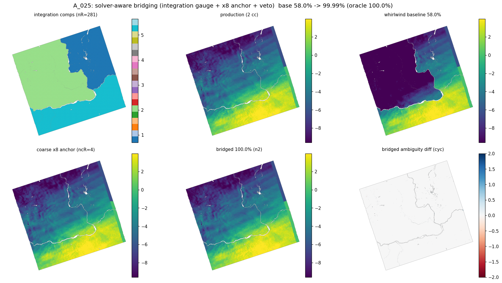

# Whirlwind 2D phase unwrapping — NISAR summary

A short, NISAR-team-facing summary of the verified 2D unwrapper. For the full
algorithm theoretical basis see [`ATBD-whirlwind.md`](../ATBD-whirlwind.md); for
the speed analysis see [`PHASS_SPEED.md`](PHASS_SPEED.md).

## What it is

Whirlwind is a Rust-backed **minimum-cost-flow (MCF) 2D phase unwrapper** with the
same conceptual backbone as SNAPHU — residues → statistical edge costs → MCF →
integration — plus a fast post-pass that repairs the relative 2π level of
mask-disconnected regions. The public entry point is `whirlwind.unwrap(igram,
corr, nlooks, mask)`; it is wired into dolphin and used by default there.

## Headline

- **Quality:** matches the trusted Python reference (`ww-orig`) on **all 13 NISAR
  GUNW frames**, and **beats it on the one hard frame** (A_025's low-coherence
  river: **58 → 99.99 %** via the bridge, vs ww-orig's 70 %). Beats isce3 **PHASS**
  on quality on every frame, often by a lot (D_075 88 vs 48, A_030 100 vs 75).
- **Speed:** ~14–41 s/frame — **~15–80× faster than single-tile SNAPHU**
  (465–1242 s) and **~3–5× faster than SNAPHU's *production* 9×9-tiled + reoptimize
  path** (90–110 s, given the same core count). ~1.5–3× faster than the Python
  reference. (PHASS is ~2–4× faster but lower quality; isce2 ICU is ~3–9× slower.)
- **Memory:** linear in pixels, **~0.2 GB per megapixel** (~3–4 GB per NISAR frame)
  — **about half single-tile SNAPHU's ~7–8 GB**, and on par with SNAPHU-9×9. Tiling
  is the only lever that lowers it further (still experimental).
- **Match metric:** per-connected-component 2π-ambiguity agreement with the
  production GUNW unwrap (which *is* SNAPHU), median-aligned per component.

## Results — 13-frame NISAR GUNW (HH, nlooks=16)

Per-component match vs the production (SNAPHU) unwrap, single-tile, one heavy
unwrap at a time. whirlwind = the public default (single-tile linear MCF + the
default-on bridge). *(Table from `scripts/sweep_all_unwrappers.sh` →
`ww_4way_final/results.csv`; runtimes are this-laptop, single-threaded-ish.)*

| frame | whirlwind % | ww-orig % | PHASS % | note |
|---|---|---|---|---|
| A_013 | 100.0 | 100.0 | 99.3 | |
| A_016 | 100.0 | 100.0 | 99.6 | |
| A_018 | 100.0 | 100.0 | 85.7 | |
| A_020 | 99.8 | 99.8 | 99.4 | |
| A_022 | 100.0 | 100.0 | 99.4 | |
| **A_025** | **100.0** | 70.3 | 67.0 | low-coh river — **bridge fixes it** |
| A_028 | 100.0 | 100.0 | 92.9 | |
| A_030 | 100.0 | 100.0 | 75.4 | |
| D_074 | 98.8 | 98.8 | 91.2 | |
| D_075 | 88.2 | 88.2 | 48.4 | hard frame — *all* methods disagree w/ SNAPHU |
| D_077 | 99.5 | 99.5 | 94.7 | |
| D_078 | 99.8 | 99.9 | 96.9 | (whirlwind −0.1, rounding-level) |
| A_035 | 100.0 | 100.0 | 94.6 | |

Runtimes (this laptop): whirlwind **14–41 s**, ww-orig 46–122 s, PHASS 5.5–23 s,
**SNAPHU single-tile 465–1242 s**, **SNAPHU 9×9 + reoptimize 90–110 s** (its
production path, same core count), isce2 ICU 109–204 s. Peak RSS: whirlwind
**~3–4 GB**, **SNAPHU single-tile ~7–8 GB**, SNAPHU-9×9 ~3–3.8 GB, PHASS ~1.7–2.4 GB,
ICU ~1.5–2.8 GB. Full per-frame numbers (5 engines × quality/runtime/memory) are in
[`nisar_4way_results.csv`](nisar_4way_results.csv); see the 3-panel figure above.

**Reading it:** whirlwind matches ww-orig **and SNAPHU** on every frame, and
strictly beats ww-orig on A_025. D_075 (88 %) is a genuinely hard scene where
ww-orig (88 %) and PHASS (48 %) also miss SNAPHU — not a whirlwind-specific failure.
The headline: whirlwind reaches **SNAPHU quality at ~3–5× faster than even SNAPHU's
tiled *production* path, and ~half the memory of single-tile SNAPHU.**
**ICU caveat:** its per-comp is scored only on the pixels it actually connects
(gaps excluded, same as PHASS); ICU leaves low-coherence land *unconnected*
(e.g. D_077 at ~81 % coverage), so a strong ICU bar can mask a coverage gap, whereas
whirlwind's MCF fills the frame. (ww-orig, the unpublished Python reference, is in
the CSV but off the figure.)

## The A_025 river — bridging

A low-coherence river splits A_025 into disconnected land slabs. The MCF integrates
each slab correctly but seeds each at an arbitrary 2π level, so their *relative*
offset is under-determined — that was the 58 %. The default-on **bridge** re-levels
each mask-disconnected region to a coherent ×8 coarse anchor (shifts taken relative
to the largest region, gated + integer-vetoed), fixing it to 99.99 % with **zero
regression** on the other 12 frames. It is a strict no-op on frames whose valid
mask is one connected region.

(Baseline 58 % → bridged 100 %. Top: integration components, production unwrap,
whirlwind baseline. Bottom: the ×8 coarse anchor, the bridged result, and the
ambiguity-diff map — the large offset slab in the baseline collapses to ~zero.)

## Algorithm in brief

1. **Residues** from the wrapped phase (2×2 loop integrals).
2. **Carballo statistical edge costs** (Lee-1994 coherence PDF, ww-orig-parity).
3. **Min-cost flow** pairing residues — primal-dual Dijkstra(8) then a
   single-source successive-shortest-paths drain (with an adaptive PD resume for
   heavily-masked frames). Exact to integer residue balance.
4. **Integration** of the cycle field along the valid mask.
5. **Bridge** post-pass (above) + SNAPHU-style connected-component labels.

## Speed note

The single-tile runtime was recently cut ~1.4–2.4× by eliminating a per-source
O(E) rescan in the SSP solver (it was ~half of D_077's runtime). The optimal flow
is byte-identical — pure speed, no quality change. Details in
[`PHASS_SPEED.md`](PHASS_SPEED.md).

## Honest scope

- **Validated and default:** the single-tile linear MCF + bridge (the table above).
- **Experimental / not validated:** the tiled pipeline (coherence *and* CRLB — it
  never reached useful results), the CRLB/phase-linked path, `reuse`/`convex`
  solvers, and the (un-built) reoptimize warm-start. None of these is part of the
  results above.
- **A_025's bridge is data-supported for narrow rivers** (×8 reconnects the banks);
  a wider, fully-decorrelated gap would be a *labeled convention*, not a
  measurement.

## Reproduce

- 4-way sweep: `scripts/sweep_all_unwrappers.sh` → `results.csv`.
- Bridge before/after, all 13: `scripts/bench_bridge_all.py`.
- A_025 bridge prototype + diagnostics: `scripts/proto_bridge_a025.py`,
  `scripts/diag_bridge_partition.py`.
- Speed profile: `scripts/prof_pdssp.py`, `WHIRLWIND_DEBUG=1`.
