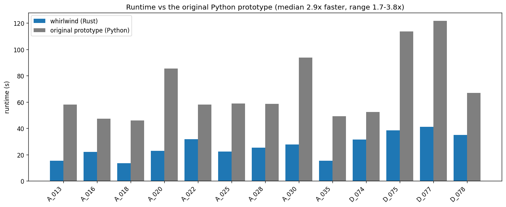

# Speed vs the original prototype (internal)

> Research note, kept out of the public docs. End users only need the shipped
> library; this is the one place the current Rust implementation is compared
> against the original Python prototype.

The Rust `whirlwind` produces the same integer 2π levels as the original Python
prototype on the 13-frame NISAR GUNW sweep (identical per-component agreement
with production SNAPHU), at a **median 2.9× lower runtime** (range 1.7–3.8×).



Reproduce from the sweep results:

```bash
python scripts/plot_speed_vs_original.py docs/nisar_4way_results.csv
```

The per-frame numbers live in [`docs/nisar_4way_results.csv`](../docs/nisar_4way_results.csv)
(the `wworig` engine rows).
